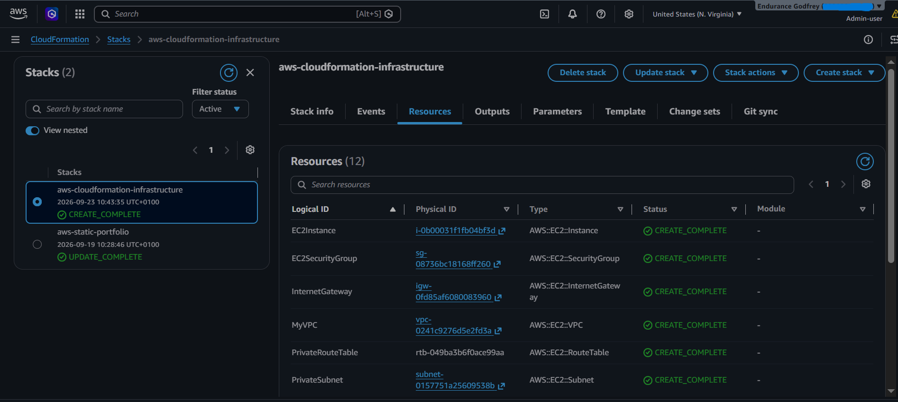
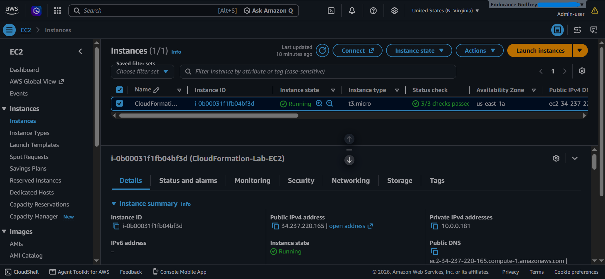

# AWS Infrastructure Automation with CloudFormation

## 1. Project Overview

This project demonstrates how to provision and manage AWS infrastructure using **AWS CloudFormation** as Infrastructure as Code (IaC).

Instead of manually creating individual AWS resources through the AWS Management Console, the infrastructure is defined in a reusable YAML template and deployed as a CloudFormation stack.

The project provisions a foundational AWS environment consisting of a VPC, public and private subnets, routing components, an Internet Gateway, a security group, and an EC2 instance.

The infrastructure was deployed and validated using the **AWS CLI**.

### Project Objectives

* Understand Infrastructure as Code using AWS CloudFormation
* Automate the provisioning of AWS networking resources
* Deploy an EC2 instance through CloudFormation
* Understand the relationship between VPCs, subnets, route tables, and Internet Gateways
* Use CloudFormation parameters, references, dependencies, and outputs
* Validate deployed resources using the AWS CLI
* Document and present cloud infrastructure in a reproducible way

---

## 2. Architecture

The infrastructure consists of a custom VPC containing separate public and private subnets.

The public subnet contains the EC2 instance and has a route to the Internet Gateway through its route table.

The private subnet does not have a direct route to the Internet Gateway, demonstrating the difference between public and private network configurations.

### Architecture Overview

```text
                         AWS Cloud
                             │
                    ┌────────▼────────┐
                    │       VPC       │
                    │   10.0.0.0/20   │
                    └────────┬────────┘
                             │
              ┌──────────────┴──────────────┐
              │                             │
      ┌───────▼────────┐            ┌───────▼────────┐
      │ Public Subnet  │            │ Private Subnet │
      │ 10.0.0.0/24    │            │ 10.0.1.0/24    │
      └───────┬────────┘            └───────┬────────┘
              │                             │
       ┌──────▼───────┐              ┌──────▼───────┐
       │ EC2 t3.micro │              │ Private Route│
       └──────┬───────┘              │    Table     │
              │                      └───────────────┘
       Security Group
          TCP Port 22
              │
       Public Route Table
              │
        0.0.0.0/0
              │
              ▼
      Internet Gateway
              │
              ▼
          Internet
```

The architecture diagram is available in the `diagrams/` directory.

---

## 3. AWS Services Used

| Service                                 | Purpose                                                                |
| --------------------------------------- | ---------------------------------------------------------------------- |
| **AWS CloudFormation**                  | Defines and provisions the infrastructure as code                      |
| **Amazon VPC**                          | Provides the isolated virtual network                                  |
| **Amazon EC2**                          | Provides the compute instance                                          |
| **Internet Gateway**                    | Provides internet connectivity for the public subnet                   |
| **Amazon VPC Route Tables**             | Controls network traffic routing                                       |
| **Amazon VPC Subnets**                  | Separates resources into public and private network segments           |
| **Amazon EC2 Security Groups**          | Controls inbound traffic to the EC2 instance                           |
| **AWS Systems Manager Parameter Store** | Provides the Amazon Linux AMI reference                                |
| **AWS CLI**                             | Used to validate, deploy, inspect, and manage the CloudFormation stack |

---

## 4. Project Structure

```text
aws-cloudformation-infrastructure/
│
├── diagrams/
│   └── architecture.png
│
├── infrastructure/
│   └── template.yaml
│
├── screenshots/
│   ├── cloudformation-stack.png
│   ├── vpc.png
│   ├── subnets.png
│   ├── route-table.png
│   └── ec2-instance.png
│
├── .gitignore
└── README.md
```

### Key Files

**`infrastructure/template.yaml`**

Contains the CloudFormation definition for the AWS infrastructure.

**`diagrams/`**

Contains the architecture diagram used to document the infrastructure.

**`screenshots/`**

Contains evidence of the deployed AWS resources and CloudFormation stack.

**`.gitignore`**

Prevents sensitive or unnecessary local files such as AWS credentials and private keys from being committed to the repository.

---

## 5. Infrastructure Design

### VPC

The project uses a custom VPC with the CIDR block:

```text
10.0.0.0/20
```

This provides the overall private address space for the infrastructure.

### Public Subnet

```text
10.0.0.0/24
```

The public subnet is configured to automatically assign public IPv4 addresses to resources launched within it.

It is associated with a route table containing:

```text
Destination: 0.0.0.0/0
Target: Internet Gateway
```

### Private Subnet

```text
10.0.1.0/24
```

The private subnet is associated with its own route table and does not have a direct route to the Internet Gateway.

This demonstrates basic network segmentation within a VPC.

### Internet Gateway

The Internet Gateway is attached to the VPC and provides the public subnet with a path to the internet through the public route table.

### EC2 Instance

The project provisions a:

```text
Instance Type: t3.micro
```

The instance is deployed into the public subnet and associated with the project's security group.

### Security Group

The security group allows SSH traffic:

```text
Protocol: TCP
Port: 22
Source: 0.0.0.0/0
```

This configuration was used to satisfy the lab requirements and demonstrate SSH access.

---

## 6. CloudFormation Implementation

The infrastructure is defined in:

```text
infrastructure/template.yaml
```

The template uses several important CloudFormation concepts.

### Parameters

The Amazon Linux AMI is provided through a Systems Manager Parameter Store reference rather than hard-coding a specific AMI ID.

```yaml
Parameters:

  LatestAmiId:
    Type: AWS::SSM::Parameter::Value<AWS::EC2::Image::Id>
```

### Resource References

CloudFormation intrinsic functions such as `!Ref` are used to connect resources.

For example:

```yaml
VpcId: !Ref MyVPC
```

This allows the subnet to reference the VPC created by the same template.

### Dependencies

The Internet Gateway route uses an explicit dependency:

```yaml
DependsOn: VPCGatewayAttachment
```

This ensures that the gateway attachment exists before the route is created.

### Outputs

The template exposes useful information after deployment, including:

* VPC ID
* Public subnet ID
* Private subnet ID
* EC2 instance ID
* EC2 public IP

This makes it easier to inspect and work with the deployed infrastructure from the AWS CLI.

---

## 7. Deployment

The project was deployed using the AWS CLI.

### Validate the CloudFormation template

```bash
aws cloudformation validate-template \
  --template-body file://infrastructure/template.yaml
```

### Deploy the stack

```bash
aws cloudformation deploy \
  --template-file infrastructure/template.yaml \
  --stack-name aws-cloudformation-infrastructure \
  --region us-east-1
```

The deployment created the AWS resources defined in the CloudFormation template.

The resulting CloudFormation stack reached:

```text
CREATE_COMPLETE
```

### Inspect the stack

```bash
aws cloudformation describe-stacks \
  --stack-name aws-cloudformation-infrastructure \
  --region us-east-1
```

---

## 8. Validation

After deployment, the infrastructure was independently inspected using the AWS CLI.

### View CloudFormation outputs

```bash
aws cloudformation describe-stacks \
  --stack-name aws-cloudformation-infrastructure \
  --region us-east-1 \
  --query 'Stacks[0].Outputs'
```

### List stack resources

```bash
aws cloudformation list-stack-resources \
  --stack-name aws-cloudformation-infrastructure \
  --region us-east-1
```

### Verify the VPC

The deployed VPC was checked to confirm:

```text
CIDR: 10.0.0.0/20
State: available
```

### Verify the subnets

The public and private subnets were inspected to confirm their CIDR ranges and public IP configuration.

### Verify the EC2 instance

The EC2 instance was inspected to confirm:

```text
Instance Type: t3.micro
State: running
```

### Verify routing

The route tables were inspected to confirm that the public route table contained:

```text
0.0.0.0/0 → Internet Gateway
```

### Verify the security group

The EC2 security group was inspected to confirm that TCP port 22 was configured for SSH access.

These checks confirmed that the deployed AWS environment matched the infrastructure defined in the CloudFormation template.

---

## 9. Screenshots

Screenshots documenting the deployment and infrastructure are stored in the `screenshots/` directory.

### CloudFormation Stack

Shows the successfully deployed CloudFormation stack and its resources.



### VPC

Shows the VPC created by CloudFormation.


### Subnets

Shows the public and private subnets created within the VPC.


### Route Table

Shows the routing configuration for the public subnet.


### EC2 Instance

Shows the EC2 instance provisioned through CloudFormation.



---

## 10. What I Learned

This project strengthened my understanding of AWS Infrastructure as Code and networking.

### Infrastructure as Code

I learned how CloudFormation can be used to define AWS infrastructure declaratively rather than creating resources manually through the AWS Management Console.

### VPC Networking

I gained a better understanding of how the following components work together:

* VPCs
* Subnets
* Route tables
* Routes
* Internet Gateways
* Security Groups

### CloudFormation Dependencies

I learned how resources can reference each other using intrinsic functions such as `!Ref` and how dependencies can be explicitly defined with `DependsOn`.

### AWS CLI

I used the AWS CLI to:

* Validate CloudFormation templates
* Deploy CloudFormation stacks
* Inspect stack resources
* Retrieve stack outputs
* Verify AWS infrastructure

### Troubleshooting

The project also reinforced the importance of validating infrastructure before deployment and verifying that the resources created by CloudFormation match the intended architecture.

---

## 11. Security Considerations

This project was created as a learning and portfolio exercise, so some configurations are intentionally simplified.

### SSH Access

The security group allows SSH from:

```text
0.0.0.0/0
```

This means the SSH port is reachable from any IPv4 address.

For a production environment, SSH access should be restricted to trusted IP addresses or replaced with a more controlled management approach such as AWS Systems Manager Session Manager.

### Credentials

No AWS credentials or private keys are stored in this repository.

The `.gitignore` file excludes common credential and private-key locations and file types.

### Public and Private Network Segmentation

The project demonstrates network segmentation by separating the public and private subnets.

The private subnet does not have a direct route to the Internet Gateway.

---

## 12. Future Improvements

Possible improvements for a more production-oriented version include:

* Replace unrestricted SSH access with restricted source IPs
* Use AWS Systems Manager Session Manager instead of SSH
* Add a NAT Gateway if private resources require controlled outbound internet access
* Deploy resources across multiple Availability Zones
* Add an Application Load Balancer
* Deploy multiple EC2 instances behind the load balancer
* Add Auto Scaling
* Add CloudWatch monitoring and alarms
* Add HTTPS using AWS Certificate Manager
* Introduce CloudFormation parameters for configurable CIDR ranges and instance types
* Add CloudFormation conditions and mappings
* Integrate the deployment with GitHub Actions for CI/CD
* Add automated CloudFormation validation to the CI/CD pipeline

---

## 13. Cleanup

Because AWS resources can incur charges, the CloudFormation stack should be deleted when the environment is no longer required.

The infrastructure can be removed using:

```bash
aws cloudformation delete-stack \
  --stack-name aws-cloudformation-infrastructure \
  --region us-east-1
```

CloudFormation will then remove the resources that it created as part of the stack.

The stack can be monitored using:

```bash
aws cloudformation describe-stacks \
  --stack-name aws-cloudformation-infrastructure \
  --region us-east-1
```

After deletion, the AWS environment should be checked to confirm that the resources created by the project have been removed.

---

## Project Status

**Status:** Completed

**Deployment:** Successful

**CloudFormation Stack:** `aws-cloudformation-infrastructure`

**Region:** `us-east-1`

**Infrastructure:** Successfully provisioned and validated using AWS CloudFormation and AWS CLI.
